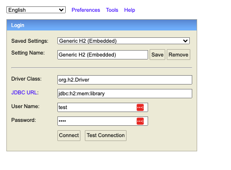

## Implementation Details

For this library application, I used Java w/ Spring Boot, as well as JPA, which facilitates persisting data to an H2 database. JPA provides annotations that allow for input validation as well as interaction with the underlying database. It provides basic CRUD methods as well as the ability to customize your own depending on the fields in classes marked with the @Entity annotation.

The architecture follows a basic MVC format. I've modeled the Author and Book object as well as provided Request DTOs for both (these are to separate the user's request from the actual author/book entity). The entry point of the application is LibraryapiApplication.java and a variety of apis are exposed in the LibraryController.java class.

For example:

1. A user makes a HTTP request with/withou a DTO body depending on the method
2. The controller handles the method and passes it to the service
3. The service queries the DB as needed and performs the required CRUD operations
4. If data is required, it is returned along with the HTTP response code

## How to Run

I've containerized this application and pushed it to DockerHub. I figured this would be the simplest way. Ensure that Docker is installed beforehand:
1. Run this command to pull the image: `docker pull fmajorcminor/library-api-app`
2. Run this command to create a container with the pulled image: `docker run -p 8080:8080 fmajorcminor/library-api-app`
3. Navigate here to view the H2 database: http://localhost:8080/h2-ui
    - Ensure that the configs look like this. The password is 'test': 
4. Click 'connect'
5. Open up Postman and let loose!

## API Documentation

1. POST localhost:8080/api/v1/books (add book)
    - Example Request Body: {
      "title": "test",
      "description": "test",
      "author": {
      "firstName": "Dallin",
      "lastName": "Christensen",
      "bio": "test"
      },
      "publishedDate": "2024-01-01"
      }
    - Example Response Body: {
      "bookId": 1,
      "title": "test",
      "description": "test",
      "author": {
      "authorId": 1,
      "firstName": "Dallin",
      "lastName": "Christensen",
      "bio": "test"
      },
      "publishedDate": "2024-01-01"
      }
2. GET localhost:8080/api/v1/books (get all books)
    - Example Response Body: [
   {
   "bookId": 1,
   "title": "test",
   "description": "test",
   "author": {
   "authorId": 1,
   "firstName": "Dallin",
   "lastName": "Christensen",
   "bio": "test"
   },
   "publishedDate": "2024-01-01"
   }
   ]

3. GET localhost:8080/api/v1/books/1 (get book from id)
    - Path variable: bookId (1 in this case) 
    - Example Response Body: {
   "bookId": 1,
   "title": "test",
   "description": "test",
   "author": {
   "authorId": 1,
   "firstName": "Dallin",
   "lastName": "Christensen",
   "bio": "test"
   },
   "publishedDate": "2024-01-01"
   }

4. PUT localhost:8080/api/v1/books/1 (update book with body & id)
    - Path variable: bookId (1 in this case)
    - Example Request Body: {
      "title": "My Book",
      "description": "test",
      "author": {
      "firstName": "Dallin",
      "lastName": "Christensen",
      "bio": "test"
      },
      "publishedDate": "2024-01-02"
      }
    - Example Response Body: {
      "bookId": 1,
      "title": "My Book",
      "description": "test",
      "author": {
      "authorId": 2,
      "firstName": "Dallin",
      "lastName": "Christensen",
      "bio": "test"
      },
      "publishedDate": "2024-01-02"
      }

5. DELETE localhost:8080/api/v1/books/2 (delete book by id)
    - Path variable: bookId

6. POST localhost:8080/api/v1/authors (create author)
    - Example Request body: {
    "firstName": "Bill",
    "lastName": "Hader",
    "bio": "Comedian"}
    - Example Response Body: {
    "authorId": 1,
    "firstName": "Bill",
    "lastName": "Hader",
    "bio": "Comedian"}
7. GET localhost:8080/api/v1/authors (get all authors)
    - Example Response Body: [
    {
        "authorId": 1,
        "firstName": "Bill",
        "lastName": "Hader",
        "bio": "Comedian"
    },
    {
        "authorId": 2,
        "firstName": "Dallin",
        "lastName": "Christensen",
        "bio": "test"
    }
]
8. GET localhost:8080/api/v1/authors/1 (get author from id)
    - Path Variable: authorId
    - Example Response Body: {
    "authorId": 1,
    "firstName": "Bill",
    "lastName": "Hader",
    "bio": "Comedian"
}
9. PUT localhost:8080/api/v1/authors/1 (update author with body & id)
    - Path variable: authorId
    - Example Request Body: {
    "firstName": "Bill",
    "lastName": "Hader",
    "bio": "Actor"
}
    - Example Response Body:{
    "authorId": 1,
    "firstName": "Bill",
    "lastName": "Hader",
    "bio": "Actor"
}
10. DELETE localhost:8080/api/v1/authors/1 (delete author by id)
    - Path variable: authorId
    - Will also delete books associated with author

## Testing

Testing done for this project was all done manually through postman and the H2 database. Given more time, I would have liked to set up JUnit tests. I also would have liked to set up Swagger-UI so that I could have a centralized place to test APIs and provide documentation.

## Tools Used

The tools used in my solution were the following:
- Java 17
- Spring Boot
- JPA
- H2 DB
- Postman for testing requests
- Docker to containerize the application
- ChatGPT was used from time to time for things such as 
  - Setting up the Dockerfile
  - Assisting me when I ran into bugs, e.g., database persistance failing due to misconfigurations, missing annotations on entity classes
- Google for searching documentation and when running into unknown errors
- All of the development and design work was done by me. I was the pilot and ChatGPT acted as co-pilot from time to time, as I normally use it during my current full-time job.